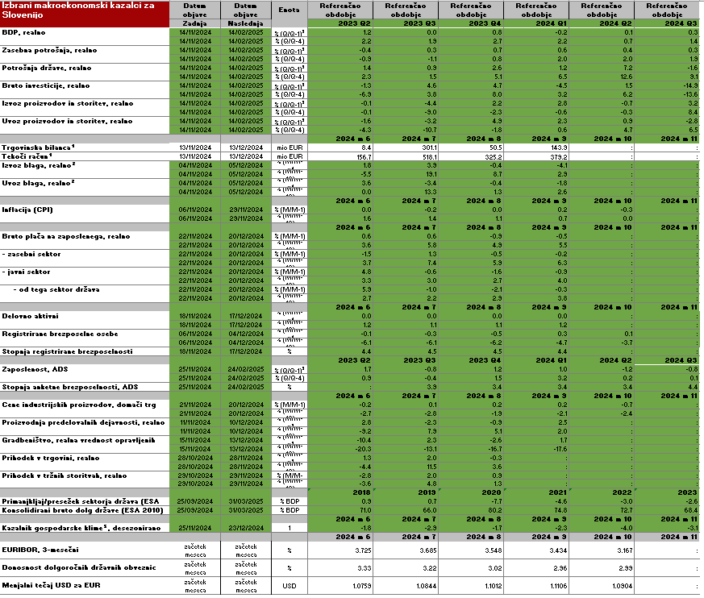

  Version        | Status   | Date
:-------------:|:--------:|:-----------:
  0.0.1          | draft    |  2024-11-25
  1.0.0          | final    |  `r Sys.Date()`

# Intro

Tale dokument opisuje tehnične zahteve in implementacijo avtomatiziranega posodabljanja redne tabele v grafih tedna, ki se nahaja na `G:\TGG\TGG_tabela_slovenska_auto_update.xlsx`

## Originalno stanje

Originalna datoteka `G:\TGG\TGG_tabela_slovenska.xlsx` vsebuje set 52 časovnih serij, vključno z datumi zadnje in naslednje objave iz SURS-a, BS, ECB-ja in lokalnih datotek, ki vsebujejo naše preračune, ki se jih na tedenski bazi ročno kopira v tabelo. 

## Zahteve

*Avtomatičen zajem podatkov in zapis v enako obliko, kot je bila do zdaj.*

*Obdobja*: tabela prikazuje podatke za šest mesecev ali šest četrtletij, vendar so prikazana obdobja enaka za vse serije in sicer jih določa objava:

- gospodarske klime pri mesečnih podatkih in 
- izdatkovne strukture pri četrtletnih podatkih

Vse ostale serije se prilagodijo tema dvema objavama, tudi če to pomeni, da so na desni strani celice brez podatkov za zadnja obdobja. 


# Implementacija in vzdrževanje

## Avtomatizirana rešitev

Skripta `O:\Avtomatizacija\umar-automation-scripts\R\tgg-tabela-si-update.R` avtomatizira posodabljanje za 47 časovnih serij - vse razen BS in ECB (zaenkrat, ker jih pe ni na naši bazi). 

Na spodnji sliki so z zeleno označena polja, ki se posodabljajo. 

Skripta je samostoječa, in ima naslednje komponente:

1. povezava na postgres podatkovno bazo
2. seznam kod za SURS-ove serije
3. funkcije za zajem in urejanje SURS-ovih podatkov
4. zajem in ureditev 27 serij iz SURS-a, vključno z datumom zadnje objave
5. funkcije za zajem in urejanje naših serij iz lokalnih Excel datotek
6. zajem in ureditev 20 serij iz osmih lokalnih datotek
7. ureditev datumov objav ZRSZ-ja
8. zajem in ureditev datumov objav SURS-a
9. branje .xslx datoteke in brisanje vseh polj, ki se imajo posodobiti
10. posodobitev polj in zapis nazaj na .xlsx datoteko. 
11. pošiljanje email-a z obvestilom o posodobivti. 

Skripta se avtomatično zažene preko batch datoteke `tgg-si-update.bat` v mapi
`O:\Avtomatizacija` `\umar-automation-scripts\batch-scripts\` in Task schedulerja na strežniku `umar-bi` vsak petek ob 10:45 in po potrebi tudi ročno. 

Posodabljanje poteka tako, da se najprej pobrišejo vsa polja, ki se imajo posodobiti, tako da v primeru neuspešnega posodabljanja posamezne serije, ostanejo prazna, namesto da bi ostali prejšnji podatki. Naloga urednika je, da na takšna prazna polja opozori Majo Z.  

Log se zapisuje v datoteko `tgg-si-update.Rout` v mapi `O:\Avtomatizacija\umar-automation-scripts\logs`. 

```{r, echo=FALSE, out.width="100%", fig.cap="Posodabljajo se zelene celice"}

```

## Vzdrževanje


Pogoji za pravilno delovanje skripte:

- stabilna struktura uporabljenih tabel na SiStat-u
- stabilno poimenovanje gesel v Surs-ovem koledarju objav
- konsistentno poimenovanje podmap v mapi `O:/DESEZONIRANJE/`, kot tudi poimenovanje datotek in zavihkov z desezoniranimi podatki. 
- **če je output .xlsx datoteka odprta med zapisovanjem**, se vanjo ne morejo shraniti novi podatki. V tem primeru bo shranjena backup datoteka, z istim imenom, samo da ima na koncu datum in uro (npr. `TGG_tabela_slovenska_auto_update_2024-12-02_09-50-12.xlsx`). 

Enkrat na leto - presumably enkrat proti koncu leta - je potrebno iz ZRSZ koledarja objav (razdelek "Sporočila za javnost o trgu dela") posodobiti spremenljivko `zrsz_days` v skripti (vrstica 458) z dvanajstimi datumi objav za naslednjih 12 mesecev. 

Po potrebi se lahko v skripto na koncu doda druge prejemnike email obvestila o posodobitvi tabele. 

## Viri 

Detajli o virih so razloženi v zadnjem poglavju, tukaj samo na kratko:

### Si-Stat

Vse serije, ki jih objavlja SURS se avtomatično zajemajo iz naše podatkovne platforme, ki se nahaja na postgres bazi na strežniku `umar-bi`. Poleg podatkov se tukaj zajame tudi datum zadnje objave, ker je to načeloma bolj zanesljivo kot iz koledarja objav, čeprav bi se oba datuma morala ujemati.  

            
### Lokalne datoteke

Desezonirani podatki, torej serije, ki jih preračunamo mi, se avtomatično zajemajo direktno iz datotek na mrežnih diskih. 

### SURS koledar objav

Datumi naslednjih objav se avtomatično zajemajo iz csv-ja objavljenega na [https://www.stat.si/statweb/ReleaseCal](https://www.stat.si/statweb/ReleaseCal)

### ZRSZ koledar objav

Datumi zadnjih in naslednjih objav za registrirane brezposelne osebe so objavljeni za celo leto na [https://www.ess.gov.si/partnerji/trg-dela/koledar-objav/](https://www.ess.gov.si/partnerji/trg-dela/koledar-objav/) in jih je potrebno enkrat na leto *ročno* vnesti v samo skripto. 


# Viri

## Surs datumi naslednjih objav {#koledar}

Surs na strani [https://www.stat.si/statweb/ReleaseCal](https://www.stat.si/statweb/ReleaseCal) objavlja koledar objav, ki je dostopen tudi kot csv. Žal je ta datoteka nepravilno formatirana, saj se v samih tekstih pojavljajo ne-escape-ana podpičja, ki so hkrati tudi delimiter, poleg tega so v tekstih tudi ne-escapan-i line breaki. To sem jim tudi sporočila in upam, da bodo popravili, ampak do takrat to rešujem na relativno nerobusten način znotraj skripte. Skratka izvoz datumov naslednjih objav deluje, vendar rešitev ni optimalna oz. robustna na nepredvidene spremembe v vsebini datoteke. 

## ZRSZ datumi naslednjih objav {#koledar2}

ZRSZ na strani [https://www.ess.gov.si/partnerji/trg-dela/koledar-objav/](https://www.ess.gov.si/partnerji/trg-dela/koledar-objav/) objavlja koledar objav za celo leto. Zanimajo nas datumi v razdelku *Sporočila za javnost o trgu dela*. Ker je html slabo strukturiran, ga je težko zanesljivo scrape-at, zato je lažje, da se datume enkrat na leto *ročno* prepiše v skripto. 

## Izdatkovna struktura

Podatki v celicah `E3:J14` in datumi zadnjih objav v celicah `B3:B14` so pridobljeni preko naše baze iz SiStata. Spodaj so prikazane kode in kategorije dimenzij za izbrane serije. 

Datumi naslednjih objav v celicah `C3:C14` so pridobljeni iz Sursovega koledarja objav pod geslom *"Bruto domači proizvod"* (glej poglavje \@ref(koledar)). 

```{r, include = FALSE, warning = FALSE, message = FALSE}
suppressPackageStartupMessages(library(dplyr))
suppressPackageStartupMessages(library(kableExtra))

################################################################################
# Data series from the platform database
################################################################################
# connect to database
con <- DBI::dbConnect(RPostgres::Postgres(),
                      dbname = "platform",
                      host = "192.168.38.21",
                      port = 5432,
                      user = "majaz",
                      password = Sys.getenv("PG_MZ_PSW"),
                      client_encoding = "utf8")
# set schema search path
DBI::dbExecute(con, "set search_path to platform")

makro_slo <-  data.frame(seq = 1:12, 
                         code = c("SURS--0300230S--B1GQ--G1--Y--Q",
                "SURS--0300230S--B1GQ--GO4--N--Q",
                "SURS--0300230S--P31_S14_D--G1--Y--Q",
                "SURS--0300230S--P31_S14_D--G4--N--Q",
                "SURS--0300230S--P3_S13--G1--Y--Q",
                "SURS--0300230S--P3_S13--G4--N--Q",
                "SURS--0300230S--P5--G1--Y--Q",
                "SURS--0300230S--P5--G4--N--Q",
                "SURS--0300230S--P6--G1--Y--Q",
                "SURS--0300230S--P6--G4--N--Q",
                "SURS--0300230S--P7--G1--Y--Q",
                "SURS--0300230S--P7--G4--N--Q"))

labels <- rep(c("BDP, realno",
"Zasebna potrošnja, realno",
"Potrošnja države, realno",
"Bruto investicije, realno",
"Izvoz proizvodov in storitev, realno",
"Uvoz proizvodov in storitev, realno"), each  = 2)

x <- tbl(con, "series") |> 
  filter(code %in% makro_slo$code) |> 
  collect() |> 
  left_join(makro_slo) |> 
  arrange(seq) |> 
  select(code, name_long) |> 
  mutate(kazalnik = labels) |> 
  relocate(kazalnik) |> 
  as_tibble()

```

```{r , echo=FALSE, results='asis', warning = FALSE, message = FALSE}

kable(x, "latex", longtable = TRUE, 
      caption = "Viri za kazalnike izdatkovne strukture", 
      row.names = FALSE, 
      booktabs = TRUE,  
      placement = "H") |> 
  kable_styling(latex_options = c("repeat_header")) |> 
  column_spec(1, width = "2.5cm") |> 
  column_spec(2, width = "3.5cm", 
              background = rep(c("white", "gray!10"), length.out = nrow(x))) |> 
  column_spec(3, width = "9cm",
              background = rep(c("white", "gray!10"), length.out = nrow(x))) |>
  collapse_rows(valign = "top",
                latex_hline = "major")
```
    
## Izvoz in uvoz

Podatki v celicah `E18:J21` so pridobljeni iz desezoniranih serij na mreži v mapi `O:/DESEZONIRANJE/Zunanja trgovina/`, v spodnji tabeli so mape (te se spreminjajo vsak mesec), imena datotek in zavihki za vsak kazalnik. Ker gre za indekse, so za vsak kazalnik iz njih potem izračunani mesečne in medletne rasti. 

Datumi zadnjih in naslednjih objav v celicah `B18:C21` so pridobljeni iz Sursovega koledarja objav za geslo *"Izvoz in uvoz blaga"* (glej poglavje \@ref(koledar)). 

```{r , echo=FALSE, results='asis', warning = FALSE, message = FALSE}

x <- data.frame(kazalnik = rep(c("Izvoz blaga, realno", "Uvoz blaga, realno"), each = 2),
`primer mape` = rep(c("Realni izvoz blaga/Leto 2024/09-24",
                      "Realni uvoz blaga/Leto 2024/09-24"), each = 2),
datoteka = rep(c("Izvoz blaga - real.xls", "Uvoz blaga - real.xls"), each = 2),
zavihek = c("SA", "Orig", "SA", "Orig"))
kable(x, "latex", longtable = TRUE, 
      caption = "Viri za kazalinke Izvoz-Uvoz", 
      row.names = FALSE, 
      booktabs = TRUE,  
      placement = "H") |> 
  kable_styling(latex_options = c("repeat_header")) |> 
  column_spec(1, width = "2.5cm") |> 
  column_spec(2, width = "5.5cm") |> 
  column_spec(3, width = "4cm") |> 
  column_spec(4, width = "2cm",
              background = rep(c("white", "gray!10"), length.out = nrow(x))) |>
  collapse_rows(valign = "top",
                latex_hline = "major")
```


## Inflacija

Podatki v celicah `E23:J24` in datumi zadnjih objav v celicah `B23:B24` so pridobljeni preko naše baze iz SiStata. Spodaj so prikazane kode in kategorije dimenzij za izbrane serije. 

Datumi naslednjih objav v celicah `C23:C24` so pridobljeni iz Sursovega koledarja objav pod geslom *"Indeksi cen življenjskih potrebščin"* (glej poglavje \@ref(koledar)). 

```{r, include = FALSE, warning = FALSE, message = FALSE}
suppressPackageStartupMessages(library(dplyr))
suppressPackageStartupMessages(library(kableExtra))

################################################################################
# Data series from the platform database
################################################################################
# connect to database

inflacija_slo <-  data.frame(seq = 1:2, 
                        code = c("SURS--H281S--1--M",
                   "SURS--H281S--2--M"))

labels <- rep(c("Inflacija (CPI)"), each  = 2)

x <- tbl(con, "series") |> 
  filter(code %in% inflacija_slo$code) |> 
  collect() |> 
  left_join(inflacija_slo) |> 
  arrange(seq) |> 
  select(code, name_long) |> 
  mutate(kazalnik = labels) |> 
  relocate(kazalnik) |> 
  as_tibble()

```

```{r , echo=FALSE, results='asis', warning = FALSE, message = FALSE}

kable(x, "latex", longtable = TRUE, 
      caption = "Viri za inflacijo", 
      row.names = FALSE, 
      booktabs = TRUE,  
      placement = "H") |> 
  kable_styling(latex_options = c("repeat_header")) |> 
  column_spec(1, width = "2.5cm") |> 
  column_spec(2, width = "3.5cm", 
              background = rep(c("white", "gray!10"), length.out = nrow(x))) |> 
  column_spec(3, width = "9cm",
              background = rep(c("white", "gray!10"), length.out = nrow(x))) |>
  collapse_rows(valign = "top",
                latex_hline = "major")
```
    
## Plače

Podatki v celicah `E26:J33` so pridobljeni iz že pravilno oblikovanih in pripravljenih podatkov v datoteki na mreži:`O:/Users/DRogan/GT/GT-place (REK).xlsx`

Datumi zadnjih in naslednjih objav v celicah `B26:C33`  so pridobljeni iz Sursovega koledarja objav za geslo *"Plače zaposlenih pri pravnih osebah"* (glej poglavje \@ref(koledar)). 

## Registrirana brezposelnost 

Podatki v celicah `E35:J39` so pridobljeni iz desezoniranih serij na mreži v mapi `O:/DESEZONIRANJE/Trg dela/`, v spodnji tabeli so mape (te se spreminjajo vsak mesec), imena datotek in zavihki za vsak kazalnik. Za vse razen zadnje serije so izračunane mesečne in medletne rasti. 

Datumi zadnjih in naslednjih objav v celicah `B35:C36` in `B39:C39` so pridobljeni iz Sursovega koledarja objav za geslo *"Izvoz in uvoz blaga"* (glej poglavje \@ref(koledar)). 

Datumi zadnjih in naslednjih objav v celicah `B37:C38` pa so pridobljeni iz koledarja objav ZRSZ  (glej poglavje \@ref(koledar2)).

```{r , echo=FALSE, results='asis', warning = FALSE, message = FALSE}

x <- data.frame(kazalnik = c(rep(c("Delovno aktivni", "Registrirane brezposelne osebe"), each = 2), "Stopnja registrirane brezposelnosti"),
                `primer mape` = c(rep(c("Delovno aktivni/Vsi/Leto 2024/09-24",
                                        "Registrirani brezposelni/Stevilo/Leto 2024/09-24"), each = 2), 
                                  "Registrirani brezposelni/Stopnje/Leto 2024/09-24"),
                datoteka = c(rep(c("DA - vsi.xls", "Stevilo reg brezposelnih zadnji.xls"), each = 2), "Stopnja reg brezposelnih.xls"),
                zavihek = c("SA", "Orig", "SA", "Orig", "Orig"))
kable(x, "latex", longtable = TRUE, 
      caption = "Viri za registrirano brezposelnost", 
      row.names = FALSE, 
      booktabs = TRUE,  
      placement = "H") |> 
  kable_styling(latex_options = c("repeat_header")) |> 
  column_spec(1, width = "3.5cm") |> 
  column_spec(2, width = "6cm") |> 
  column_spec(3, width = "4cm") |> 
  column_spec(4, width = "1.5cm",
              background = rep(c("white", "gray!10"), length.out = nrow(x))) |>
  collapse_rows(valign = "top",
                latex_hline = "major")
```


## Anketna brezposelnost 

Podatki v celicah `E41:J43` so pridobljeni iz desezoniranih serij na mreži v mapi `O:/DESEZONIRANJE/Trg dela/`, v spodnji tabeli so mape (te se spreminjajo vsak mesec), imena datotek in zavihki za vsak kazalnik. Za vse razen zadnje serije so izračunane mesečne in medletne rasti. 

Datumi zadnjih in naslednjih objav v celicah `B41:C43` so pridobljeni iz Sursovega koledarja objav za geslo *"Aktivno in neaktivno prebivalstvo"* (glej poglavje \@ref(koledar)). 

```{r , echo=FALSE, results='asis', warning = FALSE, message = FALSE}

x <- data.frame(kazalnik = c("Zaposlenost, ADS","Zaposlenost, ADS",
                                 "Stopnja anketne brezposelnosti, ADS"),
                `primer mape` = c("ILO/Zaposleni/Leto 2024/Q3 2024","ILO/Zaposleni/Leto 2024/Q3 2024", "ILO/Stopnja brezposelnosti/Leto 2024/Q3 2024"),
                datoteka = c("ILO Zaposleni - Q3 2024", "ILO Zaposleni - Q3 2024", "Stopnja ILO brezposelnih - Q3 2024"),
                zavihek = c("SA", "Orig","Orig"))
kable(x, "latex", longtable = TRUE, 
      caption = "Viri za anketno brezposelnost", 
      row.names = FALSE, 
      booktabs = TRUE,  
      placement = "H") |> 
  kable_styling(latex_options = c("repeat_header")) |> 
  column_spec(1, width = "3.5cm") |> 
  column_spec(2, width = "6cm") |> 
  column_spec(3, width = "4cm") |> 
  column_spec(4, width = "1.5cm",
              background = rep(c("white", "gray!10"), length.out = nrow(x))) |>
  collapse_rows(valign = "top",
                latex_hline = "major")
```


## Realni sektorji

Podatki v celicah `E45:J54` in datumi zadnjih objav v celicah `B45:B54` so pridobljeni preko naše baze iz SiStata. Spodaj so prikazane kode in kategorije dimenzij za izbrane serije. Za vse razen prvih dveh serij so izračunane mesečne in medletne rasti. 

Datumi naslednjih objav v celicah `C45:C54` so pridobljeni iz Sursovega koledarja objav pod gesli *"Indeksi cen industrijskih proizvodov pri proizvajalcih"*, *"Indeksi industrijske proizvodnje"*, *"Indeksi vrednosti opravljenih gradbenih del"*, *"Prihodek od prodaje v trgovini na drobno"* in *"Indeks obsega v storitvenih dejavnostih in trgovini"* (glej poglavje \@ref(koledar)). 

```{r, include = FALSE, warning = FALSE, message = FALSE}

real_slo <-  data.frame(seq = 1:10, 
                         code = c("SURS--0457201S--B_TO_E--01--M",
                "SURS--0457201S--B_TO_E--02--M",
                "SURS--1701111S--sa--C[skd]--M",
                  "SURS--1701111S--orig--C[skd]--M",
                  "SURS--1957408S--SA--CC--M",
                  "SURS--1957408S--O--CC--M",
                  "SURS--2001303S--2--2--G--M",
                  "SURS--2001303S--2--1--G--M",
                  "SURS--2080006S--2--H+I+J+L+M+N--M",
                  "SURS--2080006S--1--H+I+J+L+M+N--M"))

labels <- rep(c("Cene industrijskih proizvodov, domači trg",
"Proizvodnja predelovalnih dejavnosti, realno",
"Gradbeništvo, realna vrednost opravljenih del",
"Prihodek v trgovini, realno",
"Prihodek v tržnih storitvah, realno"), each  = 2)

x <- tbl(con, "series") |> 
  filter(code %in% real_slo$code) |> 
  collect() |> 
  left_join(real_slo) |> 
  arrange(seq) |> 
  select(code, name_long) |> 
  mutate(kazalnik = labels) |> 
  relocate(kazalnik) |> 
  as_tibble()

```

```{r , echo=FALSE, results='asis', warning = FALSE, message = FALSE}

kable(x, "latex", longtable = TRUE, 
      caption = "Viri za kazalnike realnih sektorjev", 
      row.names = FALSE, 
      booktabs = TRUE,  
      placement = "H") |> 
  kable_styling(latex_options = c("repeat_header")) |> 
  column_spec(1, width = "3.5cm") |> 
  column_spec(2, width = "3.5cm", 
              background = rep(c("white", "gray!10"), length.out = nrow(x))) |> 
  column_spec(3, width = "8cm",
              background = rep(c("white", "gray!10"), length.out = nrow(x))) |>
  collapse_rows(valign = "top",
                latex_hline = "major")
```


## Sektor država

Podatki v celicah `E56:J57` in datumi zadnjih objav v celicah `B56:B57` so pridobljeni preko naše baze iz SiStata. Spodaj so prikazane kode in kategorije dimenzij za izbrane serije. 

Datumi naslednjih objav v celicah `C56:C57` so pridobljeni iz Sursovega koledarja objav pod gesli *"Temeljni agregati sektorja država"* (glej poglavje \@ref(koledar)). 

```{r, include = FALSE, warning = FALSE, message = FALSE}

drzava_slo <-  data.frame(seq = 1:2, 
                        code = c("SURS--0314905S--B9--XDC_R_B1GQ--A",
                                 "SURS--0314905S--GD--XDC_R_B1GQ--A"))

labels <- c("Primanjkljaj/presežek sektorja država (ESA 2010)",
"Konsolidirani bruto dolg države (ESA 2010)")


x <- tbl(con, "series") |> 
  filter(code %in% drzava_slo$code) |> 
  collect() |> 
  left_join(drzava_slo) |> 
  arrange(seq) |> 
  select(code, name_long) |> 
  mutate(kazalnik = labels) |> 
  relocate(kazalnik) |> 
  as_tibble()

```

```{r , echo=FALSE, results='asis', warning = FALSE, message = FALSE}

kable(x, "latex", longtable = TRUE, 
      caption = "Viri za kazalnike sektorja država", 
      row.names = FALSE, 
      booktabs = TRUE,  
      placement = "H") |> 
  kable_styling(latex_options = c("repeat_header")) |> 
  column_spec(1, width = "3.5cm") |> 
  column_spec(2, width = "3.5cm", 
              background = rep(c("white", "gray!10"), length.out = nrow(x))) |> 
  column_spec(3, width = "8cm",
              background = rep(c("white", "gray!10"), length.out = nrow(x))) |>
  collapse_rows(valign = "top",
                latex_hline = "major")
```


## Gospodarska klima

Podatki v celicah `E59:J59` in datumi zadnjih objav v celici `B59` so pridobljeni preko naše baze iz SiStata. Spodaj so prikazane kode in kategorije dimenzij za izbrane serije. 

Datumi naslednjih objav v celicah `C59` so pridobljeni iz Sursovega koledarja objav pod gesli *"Gospodarska klima"* (glej poglavje \@ref(koledar)). 

```{r, include = FALSE, warning = FALSE, message = FALSE}

klima_slo <-  data.frame(seq = 1, 
                        code = c("SURS--2855901S--1--2--M"))

labels <- c("Kazalnik gospodarske klime, desezonirano")


x <- tbl(con, "series") |> 
  filter(code %in% klima_slo$code) |> 
  collect() |> 
  left_join(klima_slo) |> 
  arrange(seq) |> 
  select(code, name_long) |> 
  mutate(kazalnik = labels) |> 
  relocate(kazalnik) |> 
  as_tibble()

```

```{r , echo=FALSE, results='asis', warning = FALSE, message = FALSE}

kable(x, "latex", longtable = TRUE, 
      caption = "Vir za kazalnik gospodarske klime", 
      row.names = FALSE, 
      booktabs = TRUE,  
      placement = "H") |> 
  kable_styling(latex_options = c("repeat_header")) |> 
  column_spec(1, width = "3.5cm") |> 
  column_spec(2, width = "3.5cm", 
              background = rep(c("white", "gray!10"), length.out = nrow(x))) |> 
  column_spec(3, width = "8cm",
              background = rep(c("white", "gray!10"), length.out = nrow(x))) |>
  collapse_rows(valign = "top",
                latex_hline = "major")
```


