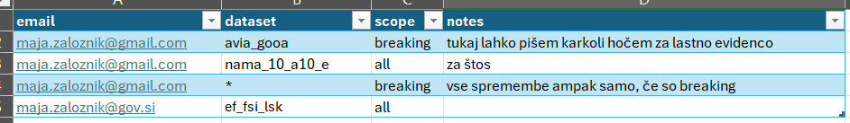

Ta dokument opisuje avtomatski monitoring strukturnih sprememb na Eurostatovi bazi in navodila za uporabnike, ki se želijo prijaviti na mailing listo za te spremembe.


# Pregled

Umar Data Bot od avgusta 2026 dalje sledi strukturnim spremembam na Eurostatovi bazi in od tega datuma dalje hrani tudi zgodovino vseh sprememb. 

Sledene so naslednje spremembe:

1. ***izbris tabele***
2. objava nove tabele
3. ***izbris dimenzije znotraj tabele*** 
4. ***dodajanje novih dimenzij znotraj tabele***
5. ***izbris kategorij znotraj dimenzij***
6. dodajanje novih kategorij znotraj dimenzij.

Spremembe se aktivirajo dvakrat na dan: ob 11:00 in 23:00. *Tukaj ne gre za napoved sprememb, ampak za izvršeno dejstvo - žal Eurostat ne objavlja napovedi strukturnih sprememb.*

Lahko se prijaviš na avtomatične maile, ki te bodo obveščali o (relevantnih) spremembah. 

Pri tem lahko izbereš ali te zanimajo:

- spremembe na vseh tabelah (teh je čez 7500, tako da tega ne priporočam, ker boš skoraj vsak dan dobil/a dva maila)
- spremembe samo na izbranih tabelah, ki te zanimajo. 

Hkrati lahko tudi določiš ali te za dotične tabele zanimajo:

- vse možne spremembe, torej vseh 6 tipov izbrisov & dodajanj naštetih zgoraj
- samo *breaking* spremembe, to so 4 tipi sprememb (zgoraj označeni), ki ti lahko pokvarijo poizvedbe.


## Postopek

Prijava na maile poteka preko skupnega Excel fajla na mreži: 

`O:\Avtomatizacija\umar-automation-scripts\data\umar_data_bot_subscriptions\eurostat_email_prijave.xlsx`

V njem je tabela, ki ima 4 stolpce. 

**email** - elektronski naslov, kamor hočeš dobivati sporočila o spremembah

**dataset** - polje kamor zapišeš *posamično* kodo tabele, ki ji želiš stediti, torej za vsako tabelo moraš dodati novo vrstico. Če resno želiš slediti vsem 7500+ tabelam, pa vneseš samo en `*`. 

**scope** - ima dve možni vrednosti: `all` ali `breaking`. Prva možnost pomeni, da dobiš obvestilo o vseh šestih tipih sprememb, druga pa samo o ta štirih "nevarnih". 

**notes** - to je za Data Bota popolnoma nepomembno polje - tukaj je samo zato, da si lahko notri napišeš karkoli ti srce poželi. 


```{r, echo=FALSE, out.width="100%", fig.cap="Primer izpolnjenih vrstic"}

```

Torej:

- vedno moraš izpolniti prva tri polja
- za vsako posamezno tabelo dodaš novo vrstico - spremembe seveda dobiš v enem samem mailu!
- shraniš in to je to!

Vedno lahko kasneje dodaš nove vrstice (vrstni red ni važen). Lahko tudi brišeš svoje vrstice, če hočeš nehati slediti določeni tabeli. Seveda ne brisati tujih vrstic, a prav?

In še to: tudi, če se ne prijaviš na nobeno tabelo, lahko vedno prideš do Maje in jo vprašaš da pogleda zgodovino - s tem da ta zgodovina obstaja samo za spremembe od 11.8.2026 dalje. 


